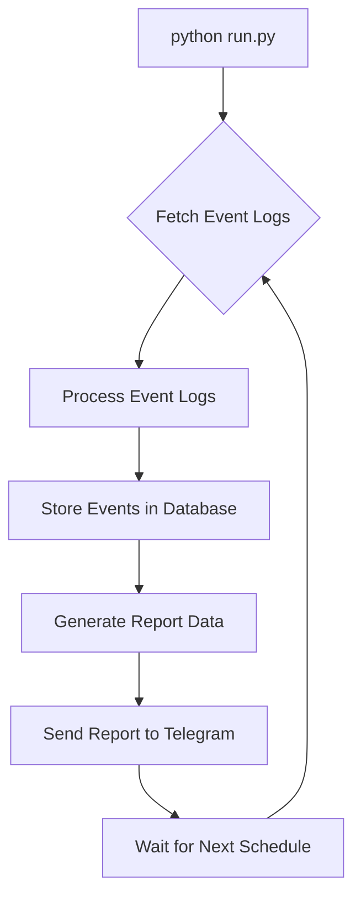
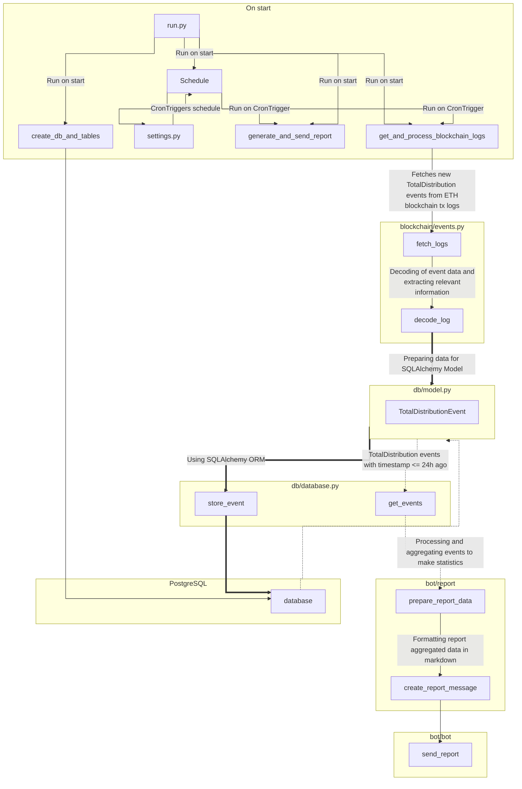

# TotalDistributionBot for Ethereum AIgentX smart contract

The TotalDistributionBot is a Python-based Telegram bot designed to monitor and report of AIX distribution events from a specified Ethereum smart contract logs. It periodically retrieves event logs and sends summaries to a designated Telegram group, facilitating real-time insights into reward distributions.

## Features

-   **Automated Monitoring**: Periodically fetches the smart contract's event log for the last 7200 blocks (approximately 24 hours).
-   **Event Summarization**: Processes and stores all events matching the `TOTAL_DISTRIBUTION_EVENT_SIGNATURE` for analysis and reporting.
-   **Telegram Integration**: Sends daily statistics and updates to a specified Telegram group.
-   **Flexible Scheduling**: Customizable schedule for fetching new events and sending reports.
-   **~~Environment Variable Support~~**: ~~Enhances security by using environment variables for sensitive information~~. (not released yet)

## Prerequisites

-   Python 3.9 or higher
-   A Telegram bot token and group ID
-   Access to an Ethereum node (via [Infura](https://infura.io/) or your own node)
-   PostgreSQL database

## Installation

1.  **Clone the repository:**

```sh
git clone https://github.com/lafabo/AIXTotalDistributionBot.git
cd total_distibution_bot
virtualenv -p Python3.9 venv
```

2. **Activate the virtualenv**
```sh
source venv/bin/activate
```
3.  **Install dependencies:**

```sh
pip install -r requirements.txt
``` 
4.  **Set up  variables:**

Edit `settings.py` file in the project root directory and add set the variables:

[**Infura**](https://infura.io):

`INFURA_KEY=your_infura_project_id`


[**Telegram**](https://t.me)

Ask [@BotFather](https://t.me/BotFather) to create a new bot
`TELEGRAM_API_KEY=your_telegram_bot_token`

You may send a link to you group to [@raw_data_bot](https://t.me/raw_data_bot) and get Your group ID
`TELEGRAM_CHAT_ID=your_telegram_chat_id` 

>Note: Telegram Supergroups ID starts with - (minus), like -123


**PostgreSQL settings**

```DB_HOST="example.com"```

```DB_USER="user"```

```DB_PASSWORD="*****"```

```DB_NAME="dbname"```

```DB_PORT="5432"```


5. **Schedule**
You can adjust schedule to your needs. 
**blockchain_events_trigger** — when retrieve new TotalDistribution events from smart contract logs
```python
blockchain_events_trigger = OrTrigger(  
    [CronTrigger(hour=8, minute=58),
    ....  
     CronTrigger(hour=17, minute=58)])
```

**telegram_report_trigger** — when to send reports to Telegram group
```python
telegram_report_trigger = OrTrigger(
	[CronTrigger(hour=9),  
	...  
	 CronTrigger(hour=17)]
```
1-3 minutes delay between retrieving new events and sending the reports far enough to process new data.


## Usage

1.  **Run the program:**

```sh
python run.py
```
The bot will initialize DB (if not initilized yet), start to gather TotalDistribution Events from smart contract logs and send automated reports according to the configured schedule. 

At startup it will fetch new data and send report message. After that it will follow the schedule.

For default values fetching logs and sending reports each 4 hours (but for demonstration porpouse i changed it to each 1 hour), and fetching events in a range last ~24 hours. The events will be stored in DB.

> **Recommend** to run this program using something like [supervisord](https://supervisord.org/).
>For auto restart if something go wrong. 

2. **Get more events** 
If you need to fetch more data (e.g. for analytics purpose) you can edit `blockchain/event.py` and add:
```python
if __name__ == "__main__":  
    last_block = *block num you want*
    start_block = *block num you want*
    # getting smart contract's logs with TotalDistribution event
    logs = fetch_logs(start_block, last_block)
    # decoding and processing logs
    for log in logs:
        event_data = decode_log(log)
        # saving them as TotalDistribution objects to db
        if event_data:
            with get_session() as session:
                store_event(event_data, session)
```
and after then run 
```sh
python blockchain/events.py
```


## PROGRAM FLOW


## PROGRAM FUNCTIONS ODD MAP



## Contributing

Feel free to submit pull requests or create issues for bugs, questions, and feature requests.

## License

Distributed under the MIT License. See `LICENSE` for more information.
